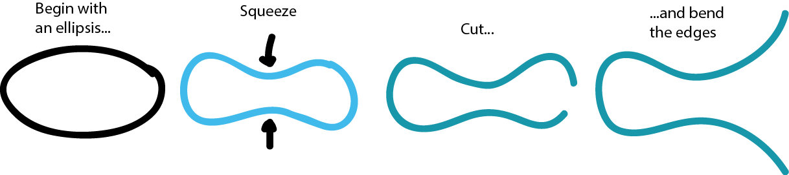
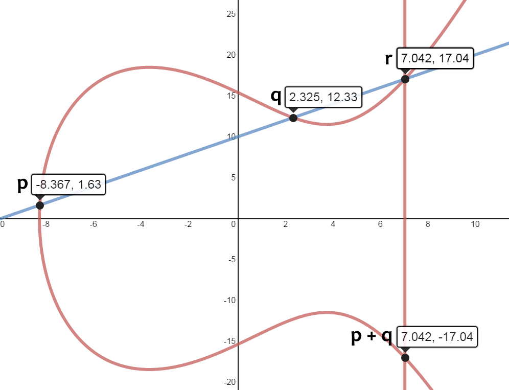

Elliptic Curve Cryptography
============================

Elliptic Curve Cryptography (or *ECC* for short) is cryptography based on arithmetics over elliptic curves. 

What is an elliptic curve? Imagine that you have an ellipsis. If you squeeze it on the middle, and cut it open on the right end, bending the two ends of the ellipsis outward, you get an elliptic curve. The curve might look a bit different depending on how much you "squeeze and "bend".



> **Definition of an elliptic curve**
> 
> An elliptic curve is described by the Weierstrass equation  for a particular . 

From any (smooth) elliptic curve, we can construct [an algebraic group](https://en.wikipedia.org/wiki/Group_%28mathematics%29)  consisting of all points ) on the curve. Remember that this group with unary operator + should have the following properties:

 1. **Closure** – 
 2. **Associativity** – &space;&plus;&space;c&space;=&space;a&space;&plus;&space;(b&space;&plus;&space;c))
 3. **Identity element** – 
 4. **Inverse** –   

Before verifying that  is a group we will try to define the unary operator +. This operator has a very nice graphical interpretation over , so let us go from there.

Point Addition
==============

Say we want to calculate the quantity  over the curve E, i.e we want to add the points ) and ) on ``E``. To do this, we draw a line ``L`` crossing ``p`` and ``q``. Since the curve is a polynomial of third degree, this line will (with one exception) intersect ``E`` at a third point ). We then define  as ).



The coordinates  and  can be described using the formula  and &space;-&space;y_p) where  and .

When ``p=q`` we use ) to calculate the slope as . This is called point doubling, and it is a special case of point addition. Here, the variable ``a`` comes from the Weierstrass equation.

If  and  we will end up with a vertical line, without a third intersection point. To fix this "problem" we introduce a point  outside the curve, called *the point at infinity*. We then say that  is the sum of these two points.

The point at infinity can be represented in any way you like, as long as it is not a point on the curve. It might be more convenient to use [homogeneous coordinates](https://en.wikipedia.org/wiki/Homogeneous_coordinates). However, if we stick with carthesian coordinates, we can pick  as the point ``(0, 0)``.

Finite Field
============

In practice, we will not do the calculations over , but over a [finite field](https://en.wikipedia.org/wiki/Finite_field). Typically you choose a prime field  where ``p`` is a prime number, or a binary field  for some . We can still use the nice formulae mentioned above, but the geometrical representation of ``+`` will no longer make any sense. 

Also, instead of division with ``x``, we do multiplication with the multiplicative inverse of  (if working in ). This routine is denoted with ``modInv(x)`` in the psuedocode below, and is typically implemented using the [Extended Euclidean Algorithm](http://www.cc.gatech.edu/~mihail/2050Lec10.pdf).  

Here follows psuedocode for the implementation of ``+`` over the finite field .
```
add(p, q)
  if p = INF
    return q
  if q = INF
    return p
  if p.x = q.x && -p.y = q.y
    return INF
  int k // slope
  if p = q
    k = 3p.x^2 + a * modInv(2p.y)
  else
    k = p.y-q.y * modInv(p.x-q.x)
  x = k^2 - p.x - q.x mod p
  y = k(p.x - x) - p.y mod p
  return (x, y)
```
Smooth Elliptic Curves are Groups
=================================

The elliptic curves from which we can construct groups, are called *smooth*. To determine if a curve is smooth, we would look for singular points. A *singular point* is a point ) such that &space;=&space;0&space;\land&space;f'(x)&space;=&space;0), i.e ``f`` contains a double root. A curve is smooth only if it does not contain any singular points. More generally, we can use a discriminant to determine if a curve is smooth.

> **Smooth curves**
> An elliptic curve is called smooth only if .

For any such curve, we can verify that the points ) on the curve with the unary operator ``+`` forms a group.

 1. **Closure** – Follows from the definition of ``+``.
 2. **Associativity** – Can be proved with [Bézout's theorem](https://en.wikipedia.org/wiki/B%C3%A9zout%27s_theorem). 
 3. **Identity element** –  is the identity element.
 4. **Inverse** – For a point ) we can construct the inverse as ). 

Trapdoor Function
=================

The trapdoor function in ECC is based on the intractability of *the discrete logarithm problem*. The discrete logarithm problem for a finite field  is to find the secret number , given . Here ``g`` denotes a point on the curve, acting as a generator for the group, and  denotes repeated addition.

Repeated addition can be thought of as multiplication of a point on the curve with an integer, resulting in another (seemingly random) point. Repeated addition can be made fast in software using the [double-and-add approach](https://en.wikipedia.org/wiki/Elliptic_curve_point_multiplication) sketched below.
```
multiply(g, s)
  assert(s > 0)
  q = INF
  // b should contain the unsigned binary representation
  // of s, e.g if s = 9 then b = 1001 
  b = s.toBinary
  for i = b.length - 1; i >= 0; --i
    if b[i] = 1
      q = add(q, g)
		g = add(g, g)
  return q
```

Double-and-add should **NOT** be used on a machine which might be monitored by an adversary since the algorithm leaks timing information. Thus, it would be possible for an adversary to mount a side-channel attack and recover information about ``s``.

A trapdoor function is commonly used in asymmetric encryption schemes, with a public and a private key. The secret value ``s`` is typically the private key, while the product  is chosen as the public key.

Standard Curves
===============

As we have previously seen, an elliptic curve over the finite field  is described by the tuple ) where ``a, b`` describes the shape of the elliptic curve, ``n`` is the order of the group (the number of points on the curve), ``g`` is a generator (base point) for the curve, and ``p`` is a prime defining the finite field $\mathbb{Z_p}$.

There are many, more or less, standardized curves. Particularly the curves recommended by NIST[^footnote1], and SECG[^footnote2].

[^footnote1]: National Security Agency: [Mathematical routines for the NIST prime elliptic curves](https://www.nsa.gov/ia/_files/nist-routines.pdf)

[^footnote2]: Certicom Research: [Standards for Efficient Cryptography - Recommended Elliptic Curve Domain Parameters, Ver. 1](http://www.secg.org/SEC2-Ver-1.0.pdf)
